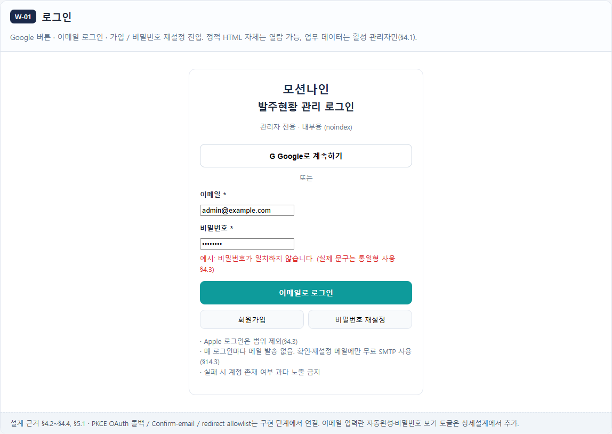
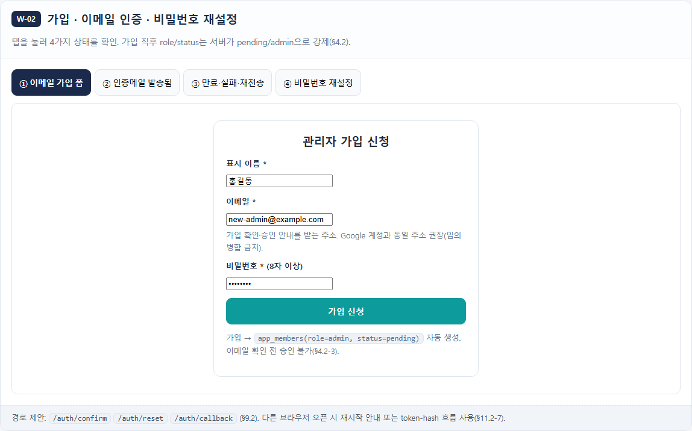
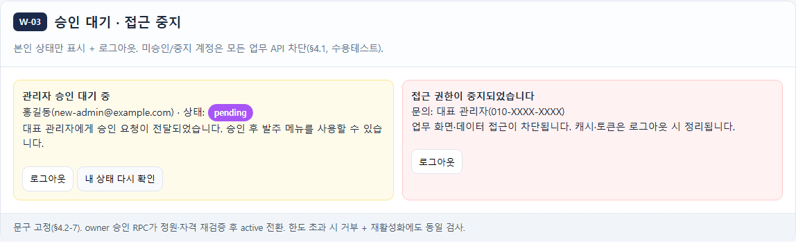
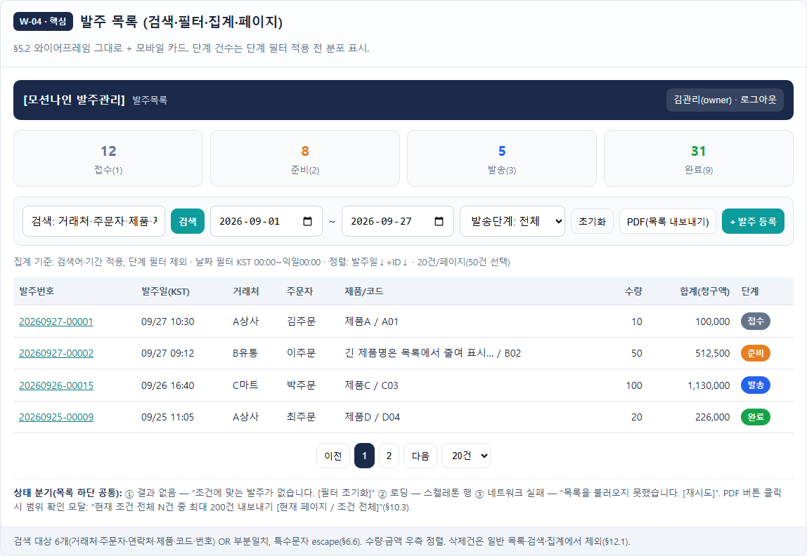
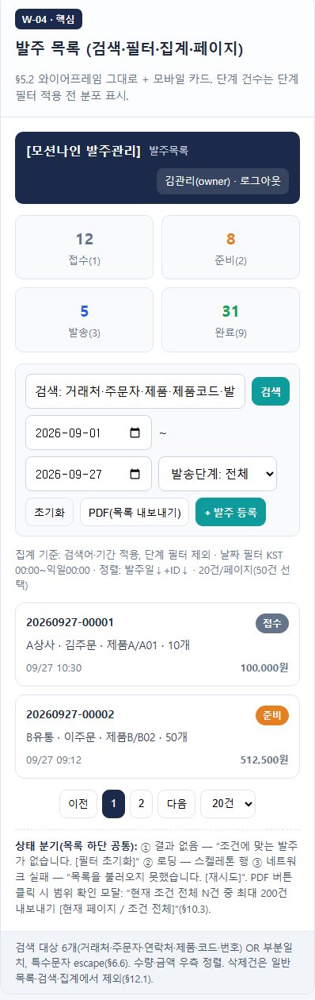
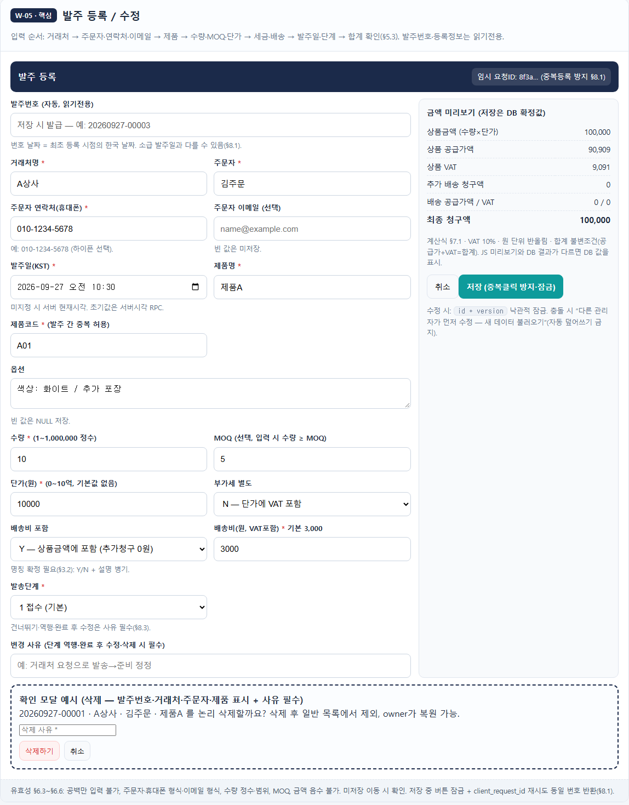
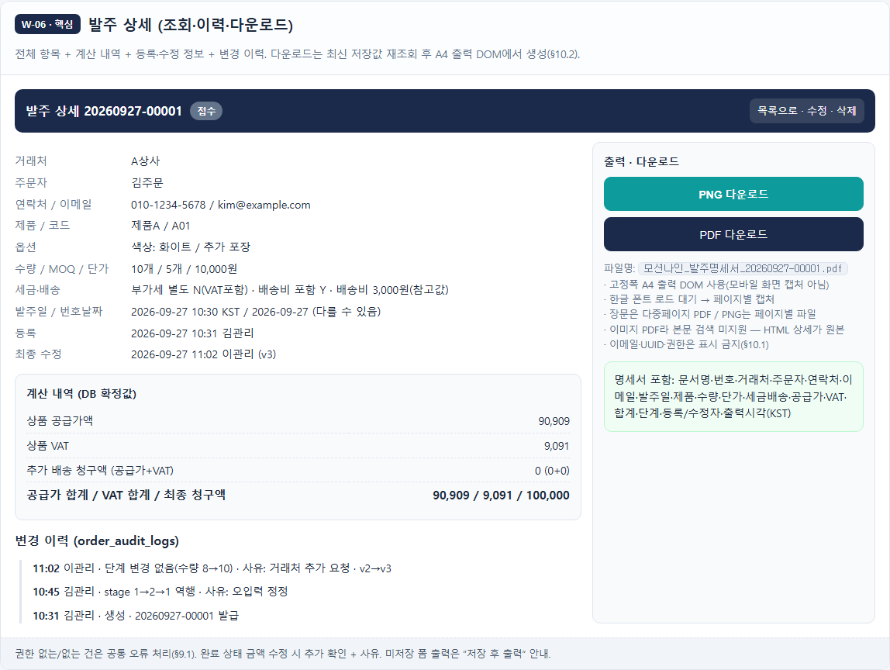
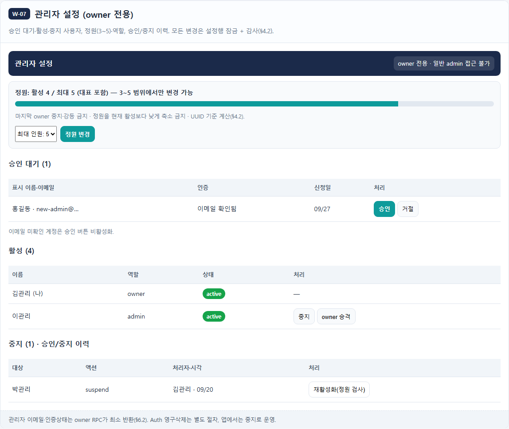
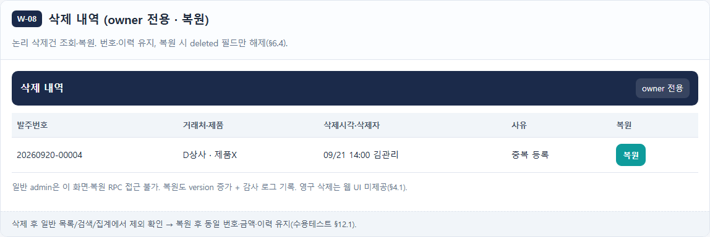

# 모션나인 발주현황 관리

관리자 3~5명이 PC와 스마트폰에서 발주를 등록하고 진행 상태와 변경 이력을 관리하기 위한 웹서비스 프로젝트입니다. 이 문서는 [화면 와이어프레임](wireframe/index.html)의 화면별 목적, 주요 기능과 흐름을 설명합니다.

> `wireframe/index.html`은 화면과 일부 미리보기 동작(PC·모바일 전환, 가입 상태 탭, 금액 계산 예시)을 보여주는 정적 와이어프레임입니다. 로그인, 실제 DB 저장, 권한검사, 검색 및 파일 다운로드가 연결된 완성 서비스는 아닙니다. 실제 구현 상태와 배포 준비사항은 [프로젝트 현황 분석](docs/프로젝트_현황_분석.md), 서비스 요구사항은 [기획설계서](docs/모션나인_발주현황_기획설계서.md)를 참고하세요.

## 화면 이동 흐름

```text
로그인 ── 가입·인증 / 비밀번호 재설정
  ├─ 미승인·중지 계정 → 승인 대기·접근 중지
  └─ 활성 관리자 → 발주 목록 ↔ 발주 등록·수정 ↔ 발주 상세
                                  └─ owner: 관리자 설정 · 삭제 내역/복원
```

화면 상단 메뉴의 `01 로그인`부터 `08 삭제내역` 링크로 이동할 수 있습니다. PC/모바일 미리보기 버튼은 와이어프레임 폭과 목록·폼 레이아웃을 바꿉니다.

## 화면별 기능 및 캡처

### W-01 로그인

Google OAuth 또는 이메일·비밀번호로 로그인하고 가입·비밀번호 재설정 화면으로 이동합니다. Apple 로그인은 제외하며, 활성 승인 관리자만 업무 데이터에 접근하도록 설계했습니다.



### W-02 가입·이메일 인증·비밀번호 재설정

이메일 가입, 인증메일 발송, 만료·실패·재전송, 비밀번호 재설정 상태를 확인합니다. 가입 직후 권한은 `admin`, 상태는 `pending`이며 owner 승인 전에는 업무 데이터에 접근할 수 없습니다.



### W-03 승인 대기·접근 중지

미승인 계정의 승인 대기 상태 및 중지 계정의 접근 차단 안내를 보여주고 로그아웃을 제공합니다. 데이터 API/RLS에서도 pending·suspended 계정을 차단해야 합니다.



### W-04 발주 목록·검색

발주번호, 발주일(KST), 거래처, 주문자, 제품·코드, 수량, 청구 합계, 발송 단계를 조회합니다. 검색어·기간·단계 필터, 단계별 건수, 20/50건 페이지 크기, 페이지 이동과 목록 내보내기 진입을 제공합니다. 검색 대상은 거래처·주문자·연락처·제품명·제품코드·발주번호입니다. 삭제된 발주는 일반 목록에서 제외합니다.



스마트폰에서는 검색 조건을 재배치하고 발주 항목을 카드로 보여줍니다.



### W-05 발주 등록·수정·삭제

발주번호는 서버에서 `YYYYMMDD-일련번호 5자리` 형식으로 발급합니다. 거래처·주문자·연락처·제품·수량·단가 등 필수 항목과 옵션·이메일·MOQ, 세금·배송 조건, 발주일·단계를 입력합니다. 기본 배송비는 3,000원, 단계는 접수, 발주일은 KST 현재 시각입니다. 화면은 금액을 미리 계산하고 저장 후 DB 확정값을 사용합니다. 변경 충돌·중복 제출을 방지하며, 삭제는 사유를 남기는 논리 삭제로 처리합니다.



### W-06 발주 상세·이력·다운로드

발주 정보와 금액 내역, 최초 등록자·일시, 최종 수정자·일시, 변경 이력을 확인합니다. 발주 명세서 PNG·PDF 다운로드 화면을 제공합니다. 출력은 A4 레이아웃을 기준으로 하며 개인정보·내부 UUID·권한 정보는 출력하지 않도록 설계했습니다. 와이어프레임의 다운로드 버튼은 실제 파일 생성과 연결되어 있지 않습니다.



### W-07 관리자 설정 (owner 전용)

가입 대기·활성·중지 관리자를 관리하고 승인·거절·중지·재활성화·역할 변경을 수행합니다. 관리자 정원은 3~5명 범위이며 승인·재활성화 시 서버에서 정원과 권한을 검사합니다. 마지막 owner는 제거할 수 없습니다.



### W-08 삭제 내역·복원 (owner 전용)

논리 삭제된 발주의 번호·거래처·제품·삭제자·시각·사유를 확인하고 복원합니다. 복원 후 기존 번호·금액·이력을 유지하고 감사 로그를 남깁니다. 일반 admin은 접근할 수 없습니다.



## 공통 화면 규칙

- 기본 정렬은 발주일 내림차순, 같은 발주일에서는 내부 ID 내림차순입니다.
- 발송 단계는 `1 접수`, `2 준비`, `3 발송`, `9 완료`이며 색상으로 구분합니다.
- PC에서는 표·다열 폼, 스마트폰에서는 카드 목록·한 열 폼·하단 저장 버튼을 사용합니다.
- 와이어프레임에 표시된 관리자와 발주 데이터는 예시입니다. 로그인, DB 저장, 실제 검색·권한 검사·파일 다운로드는 연결되지 않았습니다.

## 프로젝트 문서

- [기획설계서](docs/모션나인_발주현황_기획설계서.md)
- [계정·구현 준비 체크리스트](docs/구현착수_정보_및_준비체크.md)
- [프로젝트 현황 분석](docs/프로젝트_현황_분석.md)
- [화면 와이어프레임](wireframe/index.html)
