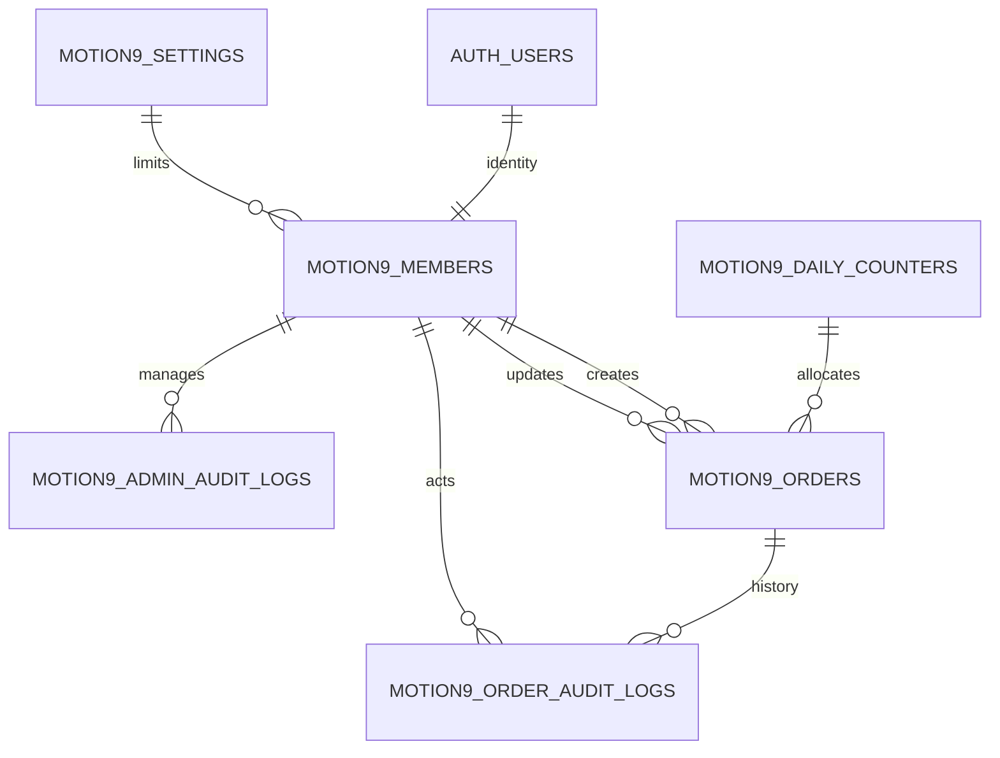

# 모션나인 발주현황 — DB 설계문서 (supabase.com 실행용, motion9_ 접두어)

- 기준: `docs/모션나인_발주현황_기획설계서.md v1.2` §6·§7·§8·§9
- 생성 SQL: `supabase/migrations/20260927000000_motion9_init.sql` (SQL Editor에 전체 1회 실행)
  + `20260927000100_motion9_add_orderer.sql` (00 기적용 시에만, 아래 §6 참조)
- v1.2 변경: 주문자 3종 (`orderer_name *`·`orderer_phone *`·`orderer_email`) 추가. 검색 6열로 확장.
- 명명 원칙: **모든 업무 테이블·함수·정책·트리거·인덱스에 `motion9_` 접두어** — 기존 테이블과 이름 충돌 방지.
  Supabase Table Editor에서 `motion9`로 필터하면 본 서비스 테이블만 모인다.

## 1. 명명 매핑 (기획서 → 실제)

| 기획서 이름 | 실제 테이블 | 스키마 | 역할 |
|---|---|---|---|
| `app_members` | `motion9_members` | public | 관리자 membership (UUID·역할·상태) |
| `orders` | `motion9_orders` | public | 발주 원본·계산확정·추적 |
| `order_audit_logs` | `motion9_order_audit_logs` | public | 발주 이력 |
| `app_settings` | `motion9_settings` | private | 단일 설정행, 정원 3~5 |
| `order_daily_counters` | `motion9_daily_counters` | private | KST 날짜별 마지막 일련번호 |
| `admin_audit_logs` | `motion9_admin_audit_logs` | private | 관리자 변경 이력 |

RPC도 동일 원칙: `motion9_get_my_access`, `motion9_get_server_time`, `motion9_search_orders`,
`motion9_stage_counts`, `motion9_create_order`, `motion9_update_order`, `motion9_change_stage`,
`motion9_delete_order`, `motion9_restore_order`, `motion9_export_orders`,
`motion9_admin_list`, `motion9_manage_member`, `motion9_update_limit`, `motion9_bootstrap_owner`.

## 2. ERD



- `MOTION9_SETTINGS → MEMBERS`는 정원 정책의 논리 관계 (FK 아님).
- `MOTION9_ORDERS.number_date → MOTION9_DAILY_COUNTERS.number_date`는 실선 FK (카운터 행 선행 생성).
- Auth 비밀번호·OAuth 토큰을 업무 테이블에 복제하지 않음.

## 3. 테이블 명세서

### 3-1. `public.motion9_members`

| 컬럼 | 타입 | 필수/기본 | 규칙 |
|---|---|---|---|
| `user_id` | uuid PK | Y | `auth.users.id` FK, 삭제 RESTRICT |
| `display_name` | varchar(100) | Y | trim 1~100자 |
| `role` | text | Y, `admin` | `owner`·`admin` |
| `status` | text | Y, `pending` | `pending`·`active`·`suspended`·`rejected` |
| `created_at` | timestamptz | Y, now() | 생성 시 기록 |
| `updated_at` | timestamptz | Y, now() | 트리거 자동 갱신 |
| `approved_at` | timestamptz | N | 승인 시점 |
| `approved_by` | uuid | N | 승인자 FK (최초 owner 초기화만 NULL 허용) |

인덱스: `(status)`.

### 3-2. `public.motion9_orders` — 입력부

| 컬럼 | 타입 | 필수 | 기본값/설명 |
|---|---|---|---|
| `id` | uuid PK | Y | 서버 생성 |
| `order_no` | varchar(14) UQ | Y | `YYYYMMDD-00001`, 정규식 + 날짜/순번 일치 CHECK |
| `number_date` | date FK | Y | 번호 발급 KST 날짜, 불변 (카운터 참조) |
| `daily_sequence` | integer | Y | 1~99999, `(number_date, daily_sequence)` UQ |
| `client_name` | varchar(100) | Y | trim 1~100 |
| `orderer_name` | varchar(100) | Y | 주문자 실명, trim 1~100 |
| `orderer_phone` | varchar(20) | Y | 휴대폰, `01X-XXXX-XXXX` (하이픈 선택), DB 정규식 CHECK |
| `orderer_email` | varchar(200) | N | 빈 값 NULL, 간단 이메일 형식 CHECK |
| `product_name` | varchar(200) | Y | trim 1~200 |
| `product_code` | varchar(100) | Y | trim 1~100, 발주 간 중복 허용 |
| `option_text` | varchar(500) | N | 빈 값 NULL |
| `quantity` | integer | Y | 1~1,000,000 |
| `moq` | integer | N | 입력 시 1 이상 + `quantity >= moq` |
| `unit_price` | numeric(12,0) | Y | 0~10억, 기본값 없음 |
| `vat_exclusive` | boolean | Y | false=N(포함, 기본) |
| `vat_rate` | numeric(5,4) | Y | 0.1000 고정 |
| `shipping_fee` | numeric(12,0) | Y | 기본 3000, VAT포함, 0~10억 |
| `shipping_included` | boolean | Y | true=Y(기본, 추가 0원) |
| `shipping_stage` | smallint | Y | 기본 1, 허용 1·2·3·9 |
| `ordered_at` | timestamptz | Y | 미지정 시 서버 현재시각, KST 표시 |
| `calculation_version` | smallint | Y | 1 고정 |

### 3-3. `public.motion9_orders` — 계산·추적부 (RPC 내부 전용)

| 컬럼 | 타입 | 설명 |
|---|---|---|
| `product_input_amount` | numeric(18,0) | 수량×단가 |
| `product_supply_amount` / `product_vat_amount` | numeric(18,0) | 상품 공급가 / VAT |
| `shipping_charge_amount` | numeric(18,0) | 추가 청구 배송비 (포함Y면 0) |
| `shipping_supply_amount` / `shipping_vat_amount` | numeric(18,0) | 별도 배송 공급가 / VAT |
| `supply_amount` / `vat_amount` / `total_amount` | numeric(18,0) | 공급합 / VAT합 / 최종 |
| `created_at`·`created_by`·`created_by_name` | — | 최초 등록, 불변 |
| `updated_at`·`updated_by`·`updated_by_name` | — | 최종 수정 (삭제 시에도 갱신) |
| `version` | integer ≥1 | 변경·삭제·복원마다 +1 |
| `client_request_id` | uuid | `(created_by, client_request_id)` UQ — 중복 방지 |
| `deleted_at`·`deleted_by`·`delete_reason` | — | 전부 NULL이거나 전부 존재 (사유 1~500자) |

합계 불변조건 (DB CHECK): `supply = 상품공급+배송공급`, `vat = 상품VAT+배송VAT`,
`total = supply+vat`, `charge = 배송공급+배송VAT`, 포함Y면 배송 3종 0.

인덱스: `(ordered_at DESC, id DESC) WHERE 미삭제` / `(stage, ordered_at DESC, id DESC) WHERE 미삭제` /
6종 trigram GIN (거래처·주문자·연락처·제품·코드·번호).

### 3-4. `public.motion9_order_audit_logs`

| 컬럼 | 타입 | 설명 |
|---|---|---|
| `id` | bigint identity PK | 순번 |
| `order_id` | uuid FK | 대상 발주, 삭제 RESTRICT |
| `action` | text | `create`·`update`·`stage_change`·`delete`·`restore` |
| `before_data` / `after_data` | jsonb | 등록은 before NULL |
| `reason` | varchar(500) | 사유 (해당 시) |
| `actor_id` / `actor_name` | — | 행위자 FK + 스냅샷 |
| `created_at` | timestamptz | 기록 시각 |

인덱스: `(order_id, created_at DESC, id DESC)` / `(actor_id, created_at DESC)`.

### 3-5. `private.motion9_settings` / `private.motion9_daily_counters`

- settings: `id smallint PK CHECK(id=1)`, `max_active_admins 3~5 DEFAULT 5`, `updated_at`, `updated_by(FK, 초기화 시 NULL)`.
- counters: `number_date date PK`, `last_value 1~99999`. 앱 직접 조회·수정 금지.

### 3-6. `private.motion9_admin_audit_logs`

`id identity PK`, `target_user_id(FK, 정원변경 시 NULL)`, `action(bootstrap/approve/suspend/reactivate/reject/change_role/change_limit)`,
`before/after jsonb`, `actor_id(초기화만 NULL)`, `created_at`.

## 4. RLS · 권한 요약

| 대상 | 조회 | 쓰기 |
|---|---|---|
| `motion9_members` | 본인 or 활성 owner (`motion9_members_select`) | 직접 쓰기 정책 없음 → RPC만 |
| `motion9_orders` | 활성 관리자 + 미삭제, 삭제건은 활성 owner만 | 직접 쓰기 정책 없음 → RPC만 |
| `motion9_order_audit_logs` | 활성 관리자 + 해당 발주 가시성 | 정책 없음 → RPC 내부만 기록 |
| private 3종 | 정책 없음 (브라우저 전면 차단) | RPC 소유자 권한만 |

- `authenticated` 테이블 권한: SELECT만. INSERT/UPDATE/DELETE 부여 없음.
- 내부 함수(`private.motion9_*`) EXECUTE 회수. 공개 RPC 13종만 `authenticated`에 부여.
- `motion9_bootstrap_owner`는 GRANT 없음 — SQL Editor 전용.

## 5. 핵심 로직 요약 (SQL 내 구현)

- 번호: `clock_timestamp()` 1회 확정 → KST 날짜 → 카운터 UPSERT → 1~99999 → `YYYYMMDD-00001`.
  `(uid, request_id)` 어드바이저리 잠금 + `(created_by, request_id)` UQ로 연타·재전송 1건 보장.
- 금액: `private.motion9_calc` 단일 식 (§7.1). VAT Y=별도, N=포함, 포함Y=추가 0.
- 단계: 정방향 인접 `(1,2)(2,3)(3,9)` 외 변경·완료(9) 후 금액 변경은 사유 필수.
- 수정·삭제·복원: `id + version` 원자 UPDATE, 불일치 시 `VERSION_CONFLICT`. 삭제는 멱등(재삭제 시 기존 반환).
- 정원: `manage_member`·`update_limit`에서 설정행 `FOR UPDATE` 잠금 + 활성 인원 계수 + 마지막 owner 보호.
- 검색: 6열 OR (거래처·주문자·연락처·제품·코드·번호)·ILIKE(`%_\\` escape)·바인딩, KST 경계(종료일+1일 00:00+09 미만), size≤50, 정렬 고정.

## 6. supabase.com 실행 순서

1. Supabase 프로젝트 생성 → **SQL Editor** 열기.
2. 미적용 상태면 `20260927000000_motion9_init.sql` 전체 복사·실행 (1회, 부분 실행 금지).
   이미 00을 적용했다면 `20260927000100_motion9_add_orderer.sql` 실행 후 00 파일 전체를 한 번 더 실행
   (함수·정책·권한이 주문자 대응 버전으로 교체됨. 冪等이므로 안전).
3. 검증 (주석 해제 후 1줄씩):
   - `select * from private.motion9_settings;` → 1행(5).
   - RPC 14개 존재 (`motion9\_%` 조회).
4. 최초 owner 초기화 — 가입·로그인 후 Auth UUID 확인 (`Authentication > Users`에서 복사):
   `select * from public.motion9_bootstrap_owner('<Auth-UUID>', '대표관리자');`
5. `Table Editor`에서 `motion9` 필터 → 6개 테이블 확인.
6. `Authentication > Sign In / Up`에서 Google·Confirm email·SMTP 설정 후 나머지 관리자 승인 (W-07 화면 또는 `motion9_manage_member` 직접 호출).

## 7. 롤백 (필요 시, 순서대로)

```sql
drop trigger if exists trg_motion9_new_user on auth.users;
drop schema private cascade;  -- private motion9_* 전체 + 내부 함수 삭제 주의: private 스키마에 타 서비스 객체가 있으면 개별 drop
drop table if exists public.motion9_order_audit_logs;
drop table if exists public.motion9_orders;
drop table if exists public.motion9_members;
-- 공개 RPC 14종은 위 테이블 삭제 후에도 남으므로 필요 시 개별 drop function
```

> `private` 스키마를他 서비스와 공유 중이면 `cascade` 금지 — `motion9_` 객체만 개별 DROP할 것.
