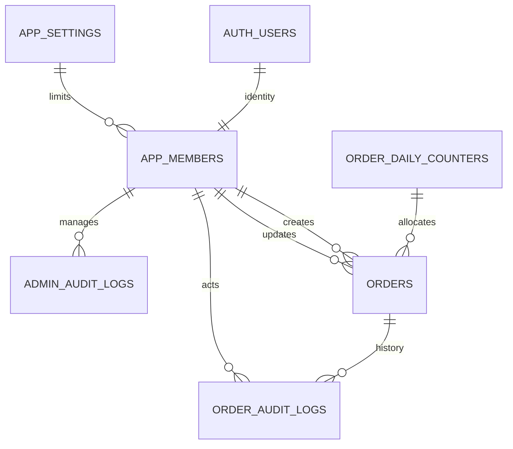

# 모션나인 발주현황 관리 웹서비스 기획·설계서

- 문서 버전: v1.2
- 작성일: 2026-09-27, 한국시간(Asia/Seoul)
- 문서 상태: 구현 전 설계안. 사용자 확정 요구사항과 설계자가 제안한 업무 규칙을 구분한다.
- 대상: 관리자 3~5명이 PC·스마트폰에서 사용하는 사내 발주 관리 서비스
- 이번 산출물: 서비스 기획, 화면 설계, 데이터베이스 설계, 인증·권한 설계, 배포·검증 계획
- 실제 서비스 구현, 계정 개설, DB 생성 및 공개 배포는 아직 수행하지 않았다.
- v1.1 변경: 사용자 요청으로 Apple 인증 제외, 이메일 무료 사용 원칙 적용, Cloudflare Pages Free 기능별 가능 여부와 제한사항 재검토(14장).
- v1.2 변경: 사용자 요청으로 주문자 3종 추가 — 주문자(필수), 주문자 연락처(휴대폰, 필수), 주문자 이메일(선택). 입력 순서·DB·검색·명세서에 반영.

## 1. 권장 구성과 핵심 결정

**HTML5 + Vanilla JavaScript + CSS + Bootstrap으로 반응형 화면을 만들고, Supabase Free에서 인증과 PostgreSQL DB를 운영하며, Cloudflare Pages Free에 정적 웹사이트를 배포한다.**

별도 상시 실행 서버는 두지 않는다. 브라우저는 Supabase SDK로 로그인하고, 조회는 RLS가 적용된 데이터 API, 저장·수정·삭제는 DB 함수(RPC)를 사용한다. 번호 생성, 금액 확정, 관리자 권한 검증은 DB에서 처리한다.

| 구분 | 제안 | 이유 |
|---|---|---|
| 화면 | HTML5, CSS, JavaScript ES Modules | 요구사항 준수, 정적 배포 가능 |
| 무료 UI | Bootstrap 5.3 계열 + 자체 CSS | 상업·사내 사용 가능한 MIT 라이선스, 반응형 컴포넌트 제공 |
| 인증 | Supabase Auth | Google, 이메일/비밀번호 인증 통합; Apple 제외 |
| 데이터 | Supabase PostgreSQL Free | 관계형 데이터, 트랜잭션, RLS 지원 |
| 배포 | Cloudflare Pages Free | 정적 사이트 무료 호스팅, HTTPS, 기본 도메인 활용 |
| 이메일 | Supabase Custom SMTP + 무료 발송 수단 | 보유 도메인이 있으면 Resend Free, 없으면 전용 Gmail SMTP 소규모 시연 검증 |
| 파일 다운로드 | html2canvas + jsPDF | 브라우저에서 PNG·PDF 생성, DB 파일 용량 절약 |
| 인원 제한 | 활성 관리자 최대 5명, 필요 시 3~5로 설정 | 대표 관리자도 정원에 포함 |

Bootstrap 사용 시 배포 파일의 저작권·라이선스 고지를 유지한다. [Bootstrap 라이선스](https://getbootstrap.com/docs/5.3/about/license/)

**무료 사용 원칙:** Apple 인증은 제외한다. UI·정적 호스팅·인증·소규모 DB는 무료 플랜으로 구성한다. 이메일도 무료 한도 내에서만 사용하며 유료 플랜·초과 과금·도메인 구매를 자동으로 진행하지 않는다. 메일 발송 계정의 사용 조건과 실제 수신 테스트를 통과해야 이메일 가입·인증까지 무료 시연 가능한 것으로 판정한다. 상세 조건은 14장에 정리한다.

## 2. 요구사항 대응표

| 번호 | 사용자 요구사항 | 설계 반영 |
|---|---|---|
| 1 | 관리자 3~5명만 접속 | 승인된 활성 관리자만 업무 화면·데이터 접근, DB에서 정원 강제 |
| 2 | Google·이메일 가입 및 인증, Apple 제외 | Supabase Auth, 이메일 확인 후 관리자 승인, 이메일 무료 한도 준수 |
| 3 | Supabase 무료 DB | PostgreSQL Free, 다운로드 파일은 기본적으로 서버 미보관 |
| 4 | HTML5·JS·CSS | 프레임워크 없이 ES Modules 기반 화면 구현 |
| 5 | 등록·수정·삭제·조회·검색 | 발주 CRUD, 검색·필터·페이지네이션, 논리 삭제 |
| 6 | 이미지·PDF 다운로드 | 발주 상세 PNG·PDF, 검색 결과 목록 PDF |
| 7 | PC·스마트폰 반응형 | PC 테이블, 모바일 카드, 모바일 전체 화면 입력 |
| 8 | 무료 UI·배포·시연 | Bootstrap + Cloudflare Pages, 실제 계정으로 시연 검증 |
| 9 | 발주 필드와 기본값 | 6장 데이터 사전, 7장 계산 규칙에 명시 |
| 10 | YYYYMMDD-5자리 일련번호 | 한국 날짜별 카운터, DB 트랜잭션에서 원자적으로 발급 |

## 3. 업무 범위와 잠정 가정

### 3.1 1차 구현 범위

- 로그인, 이메일 가입·인증·비밀번호 재설정, 로그아웃
- 대표 관리자의 사용자 승인·중지·재활성화 및 정원 관리
- 발주 등록·상세·수정·삭제·복원
- 거래처·제품·발주번호 검색, 발주일·발송단계 필터, 정렬·페이지네이션
- 상세 PNG/PDF 다운로드 및 검색 결과 목록 PDF 다운로드
- 발송단계 변경과 등록·수정·삭제 이력 확인
- 반응형 화면과 무료 환경 배포를 통한 시연

거래처·제품 마스터 관리, 재고·정산, 세금계산서 발행, 택배 API, 결제, 외부 고객 접속, 복수 사업장, 푸시 알림은 1차 범위에 포함하지 않는다. 다운로드 문서는 내부 발주 명세서이며 세금계산서 기능을 제공하지 않는다.

### 3.2 구현 전에 확인할 잠정 가정

다음은 요구사항에 명확히 없는 사항을 설계 진행을 위해 제안한 것이다. 변경 시 화면·DB·검증 기준에 함께 반영한다.

| 항목 | 제안 기본안 | 결정 영향 |
|---|---|---|
| 관리자 정원 | 대표 포함 활성 계정 최대 5개, 설정 가능 범위 3~5 | 최소 3명이 있어야 서비스가 켜지는 의미는 아님 |
| 발주 단위 | 발주 1건 = 제품·옵션 1종 | 한 발주에 여러 품목이 필요하면 `order_items` 분리 필요 |
| 단가 | 필수 `unit_price` 추가, 기본값 없음 | 수량만으로 부가세·합계를 산출할 수 없어 필요 |
| 통화·수량 | KRW 정수 원, 수량은 양의 정수 | 외화·중량·소수 수량은 추후 확장 |
| 부가세 별도 N | 입력 단가에 VAT 포함 | 면세라는 의미가 아님 |
| 배송비 포함 Y | 상품금액에 배송비가 이미 포함되어 추가 청구 0원 | 포함 N이면 설정 배송비를 별도 가산 |
| 배송비 금액 | VAT 포함 금액으로 입력, 기본 3,000원 | VAT를 배송비에 다시 10% 가산하지 않음 |
| 세율·반올림 | 과세 10%, 원 단위 반올림 | 면세·영세율은 1차 미지원, 실제 업무 기준 확인 필요 |
| MOQ | 입력했다면 수량이 MOQ 미만인 저장 차단 | 예외 주문 허용 여부는 별도 결정 |
| 발주번호 날짜 | 최초 등록 시점의 한국 날짜 | 소급 발주일 입력·수정에도 번호 유지 |
| 삭제 | 논리 삭제, 대표 관리자 복원 가능 | 발주번호·변경 이력 보존 |
| 상태 역행 | 사유 필수로 허용 | 잘못 변경한 단계를 수정 가능 |

배송비 포함 여부는 특히 확인이 필요하다. 사용자가 의도한 Y가 “총 청구액에 배송비를 더한다”라면 현재 제안과 반대이므로 개발 전에 명칭과 계산식을 확정한다. 화면에는 Y/N만 두지 않고 “상품금액에 포함 / 별도 청구”를 함께 표시한다.

## 4. 인증과 관리자 권한

### 4.1 역할과 접근 범위

| 기능 | 미로그인 | 미승인/중지 계정 | 일반 관리자 `admin` | 대표 관리자 `owner` |
|---|---|---|---|---|
| 로그인·가입·인증 | 가능 | 가능 | 가능 | 가능 |
| 본인 승인 상태 확인 | 불가 | 가능 | 가능 | 가능 |
| 발주 조회·검색·등록·수정·다운로드 | 불가 | 불가 | 가능 | 가능 |
| 발주 논리 삭제 | 불가 | 불가 | 가능 | 가능 |
| 삭제 발주 조회·복원 | 불가 | 불가 | 불가 | 가능 |
| 발주 변경 이력 | 불가 | 불가 | 가능 | 가능 |
| 관리자 승인·중지·설정 변경 | 불가 | 불가 | 불가 | 가능 |
| 영구 삭제·DB 직접 관리 | 불가 | 불가 | 불가 | 웹 UI에서는 불가 |

로그인 화면과 정적 HTML 자체는 인터넷에서 열릴 수 있다. 보호 대상은 관리자 업무 화면과 발주 데이터다. 미승인 사용자가 외부 공급자 인증에 성공해 Auth 계정이 만들어져도 업무 권한은 부여하지 않는다. 업무 데이터에 대한 모든 요청은 활성 관리자 여부를 DB에서 다시 검사한다.

### 4.2 가입·승인 흐름

1. 사용자가 이메일/비밀번호로 가입하고 인증 메일 링크를 확인하거나, Google로 인증한다.
2. 서버 측 사용자 생성 트리거가 `app_members`에 `role=admin`, `status=pending`을 고정값으로 생성한다. 가입자가 보낸 role/status 메타데이터를 신뢰하지 않는다.
3. 이메일 가입자는 확인 완료 전 승인할 수 없다. Google 계정은 공급자의 검증된 identity를 확인한다.
4. 대표 관리자가 사전에 협의한 사람인지 확인하고 승인한다. 이메일 문자열 일치만으로 자동 승격하지 않는다.
5. 승인 RPC가 설정 행을 잠그고 활성 인원 및 승인 자격을 재검증한 뒤 `active`로 전환한다.
6. 한도가 차면 승인을 거부한다. 중지 계정 재활성화에도 동일한 검사를 적용한다.
7. 미승인 화면은 “관리자 승인 대기”, 중지 화면은 “접근 권한이 중지되었습니다”만 표시한다.

대표 관리자 최초 1명은 배포 담당자가 검증된 Auth UUID를 지정해 서버 측 초기화 SQL로 등록한다. “가장 먼저 가입한 사람을 대표로 승격”하는 규칙은 사용하지 않는다. 초기화도 정원 검사를 거친다.

활성 대표 관리자는 최소 1명을 유지한다. 마지막 대표 중지·강등을 금지하고, 정원을 현재 활성 인원보다 낮게 줄이는 것도 금지한다. 승인·중지·역할 변경·정원 변경은 모두 같은 설정 행을 먼저 잠가 동시 요청에도 제한을 유지한다.

정원은 로그인 세션 개수가 아닌 활성 Auth 사용자 UUID 수로 계산한다. 여러 로그인 수단이 동일 사용자로 연결되면 1명이며, 별도 UUID라면 별도 계정으로 계산된다. 같은 사람이 가진 별도 계정을 동시에 승인하지 않는 운영 원칙을 둔다.

### 4.3 로그인 방식별 설정

**Google**

- Google Cloud OAuth 클라이언트와 동의 화면을 설정한다.
- Supabase의 Google provider에 Client ID/Secret을 등록한다.
- Google 승인 리디렉션 URI는 `https://<project-ref>.supabase.co/auth/v1/callback`으로 등록한다.
- 동의 화면의 테스트 상태·허용 사용자 등은 시연 계정이 실제 로그인 가능한지 확인한다.

참고: [Supabase Google 로그인](https://supabase.com/docs/guides/auth/social-login/auth-google)

**Apple: 범위 제외**

비용에 관한 사용자 결정으로 로그인 버튼·provider 설정·관련 테스트를 구현 범위에서 제거한다. Google과 이메일 계정 연결이 필요하면 Supabase의 identity linking 절차를 검증해 적용하고, 앱이 이메일 문자열만으로 임의 병합하지 않는다. [Supabase identities](https://supabase.com/docs/guides/auth/identities)

**이메일/비밀번호**

- Confirm email을 활성화한다. 비밀번호는 Supabase Auth에서 관리하고 업무 테이블에는 저장하지 않는다.
- 인증 링크 만료·재전송·이미 인증 완료·비밀번호 재설정 화면을 제공한다.
- 가입·재전송·재설정에 속도 제한을 적용하고, 계정 존재 여부가 과도하게 노출되지 않도록 메시지를 통일한다.
- 기본 SMTP는 조직 팀에 속한 주소로만 발송 가능하며 현재 시간당 2건 제한이 있어, 실제 관리자 대상 시연에는 Custom SMTP를 사용한다. 앱 관리자 계정과 Supabase 조직 팀원 계정은 별개다. [Supabase SMTP 안내](https://supabase.com/docs/guides/auth/auth-smtp)
- 이메일은 가입 확인·재전송·비밀번호 재설정에만 사용한다. 일반 로그인은 이메일/비밀번호 방식으로 처리해 매 로그인마다 메일을 보내지 않는다.
- 무료 한도 또는 발송 차단에 도달하면 재시도 가능 시점·대체 로그인 안내를 표시한다. Google 대체 로그인은 이미 해당 사용자에게 연결·승인된 경우에만 업무 접근을 허용한다.
- 메일이 오지 않는다고 인증을 자동 완료 처리하지 않는다. 무료 SMTP 선정과 세부 한도는 14.3절을 따른다.

### 4.4 세션·키·데이터 보안

- Supabase Auth SDK의 OAuth PKCE 흐름을 사용하고, 콜백에서 code 교환·에러 처리를 구현한다.
- 브라우저에는 Supabase URL과 publishable key(또는 기존 anon key)만 포함한다. `service_role`, secret key, OAuth 비밀키, SMTP 비밀번호는 넣지 않는다.
- 프런트 빌드 환경변수도 최종 번들에 들어가면 공개 정보다. 비밀값 보관 수단으로 사용하지 않는다.
- 업무 권한은 JWT의 오래된 role 값만으로 판정하지 않고 현재 DB membership으로 확인한다. 중지 직후 다음 데이터 요청부터 차단한다.
- 보호 화면 진입 시 세션·승인 상태를 확인하고, 로그아웃·권한 오류 시 화면·메모리·쿼리 캐시를 비운다.
- 업무 데이터와 토큰을 앱 자체 로그·분석 도구에 기록하지 않는다. 오프라인 업무 데이터 캐시·Service Worker는 1차에서 제외한다.
- 브라우저 세션은 탭 단위 `sessionStorage` 사용을 기본안으로 하고 SDK 갱신·콜백 흐름과 함께 검증한다. JavaScript 접근 가능 저장소이므로 XSS 방지가 필수다.
- 사용자 입력은 `textContent` 등으로 출력하고 임의 HTML로 삽입하지 않는다. CSP를 적용하고 라이브러리를 버전 고정·자체 호스팅한다.
- 등록된 실제 배포 URL만 Auth redirect allowlist에 둔다. 시연용·개발용 환경을 명확히 구분하고 운영에 무제한 와일드카드를 두지 않는다.
- 공개 검색엔진에는 `noindex`를 지정한다. 이는 검색 노출 방지이며 접근 통제 수단이 아니다.

## 5. 화면과 사용자 경험

### 5.1 화면 목록

| 화면 | 주요 내용 |
|---|---|
| 로그인 | 모션나인 로고, Google 버튼, 이메일 로그인, 가입·비밀번호 재설정 |
| 가입/인증 결과 | 이메일 확인 안내, 재전송, 인증 실패·만료 처리 |
| 승인 대기/접근 중지 | 본인 상태, 로그아웃 |
| 발주 목록 | 단계별 건수, 검색·필터, 테이블/카드, 등록 버튼, 목록 PDF |
| 등록/수정 | 거래처·제품·옵션·수량·단가·배송비·날짜·상태, 금액 미리보기 |
| 상세 | 발주번호, 전체 항목, 계산 내역, 등록·수정 정보, 이력, 다운로드 |
| 관리자 설정 | 승인 대기·활성·중지 사용자, 정원, 역할, 승인/중지 이력 |
| 삭제 내역 | 대표 관리자 전용 조회·복원 |

### 5.2 목록 화면 와이어프레임

```text
[모션나인 발주관리]                           [사용자] [로그아웃]

[접수 12]      [준비 8]       [발송 5]       [완료 31]

[검색: 거래처·제품·제품코드·발주번호                  ] [검색]
[발주일 시작 ~ 종료] [발송단계 전체] [초기화] [PDF] [+ 발주 등록]

 발주번호       발주일       거래처   주문자   제품/코드   수량   합계   단계
 20260927-00001  09/27 10:30  A상사    김주문    제품A/A01    10  100,000 접수

                           [이전] [1] [2] [다음]
```

- 기본 필터는 전체 기간·전체 단계, 기본 정렬은 발주일 내림차순 + 내부 ID 내림차순이다.
- 단계별 건수는 현재 검색어·기간 조건을 적용하되 단계 필터를 적용하기 전의 분포로 표시한다.
- 날짜 필터는 한국시간 시작일 00:00 이상, 종료일 다음 날 00:00 미만으로 조회한다.
- 기본 20건, 선택 50건 페이지네이션. 전체 데이터를 브라우저에 받아서 검색하지 않는다.
- 검색 대상은 거래처명·주문자명·주문자 연락처·제품명·제품코드·발주번호, 부분 일치 OR 검색이다.
- 검색 버튼/Enter로 실행하며, 결과 없음·로딩·네트워크 실패·재시도 상태를 구분한다.
- 긴 제품명은 목록에서 줄여 표시하고 상세에서 전체 표시한다. 수량·금액은 우측 정렬한다.

### 5.3 입력 화면

입력 순서는 거래처 → 주문자·연락처·이메일 → 제품명·코드·옵션 → 수량·MOQ·단가 → 세금·배송 조건 → 발주일·발송단계 → 합계 확인이다.

- 필수 필드에 `*`, 잘못된 필드는 바로 아래에 구체적 안내를 표시한다.
- 발주번호와 최초/최종 등록 정보는 서버 자동 생성으로 읽기 전용이다.
- 저장 중 버튼을 잠그고, 미저장 변경을 두고 이동할 때 확인한다.
- 수정 충돌 시 다른 관리자가 먼저 수정했음을 알리고 새 데이터를 불러오게 한다. 자동 덮어쓰기는 하지 않는다.
- 완료 상태에서 수량·단가·금액을 바꾸는 경우 추가 확인을 표시하고 변경 사유를 받는다.
- 삭제 확인창은 발주번호·거래처·주문자·제품을 보여주며 삭제 사유를 받는다.

### 5.4 반응형·스타일

| 화면 너비 | 목록 | 입력/상세 |
|---|---|---|
| 992px 이상 | 전체 테이블 | 2열 폼, 우측 금액 요약 |
| 768~991px | 중요 열 중심 테이블 | 1~2열 폼 |
| 767px 이하 | 발주별 카드 | 전체 화면 1열, 하단 저장 버튼 |

흰색/밝은 회색 바탕, 진한 네이비 헤더, 청록색 주요 버튼을 제안한다. 상태는 접수 회색·준비 주황·발송 파랑·완료 초록과 텍스트를 함께 쓴다. 모바일 터치 영역은 44px 이상, 본문은 16px 수준으로 하고 가로 스크롤 없이 핵심 업무를 처리한다. 키보드 포커스·레이블·명도 대비를 확인한다.

## 6. DB 설계

### 6.1 구조와 관계

1차는 제품 하나당 발주 하나로 관리하여 `orders`에 거래처·제품 정보를 당시 값으로 저장한다. 제품명이나 거래처명이 나중에 바뀌어도 과거 발주를 자동 수정하지 않는다.



`APP_SETTINGS`와 membership의 연결은 정원 정책을 나타내는 논리 관계다. 업무 DB에는 Auth 비밀번호·OAuth 토큰을 복제하지 않는다.

| 테이블 | 스키마 | 역할 |
|---|---|---|
| `app_members` | public | 사용자 UUID, 승인 상태, 역할, 표시 이름 |
| `orders` | public | 발주 원본·계산 결과·등록/수정 메타데이터 |
| `order_audit_logs` | public | 발주 변경·삭제·복원 이력 |
| `app_settings` | private | 단일 설정 행, 정원 3~5명 |
| `order_daily_counters` | private | 한국 날짜별 마지막 발주 일련번호 |
| `admin_audit_logs` | private | 관리자 승인·중지·역할·정원 변경 이력 |

`private`는 Data API 노출 스키마에서 제외하고 브라우저 역할의 직접 접근 권한을 제거한다. 관리자 설정·감사 조회는 필요한 필드만 반환하는 제한된 RPC로 제공한다.

### 6.2 `public.app_members`

| 컬럼 | PostgreSQL 타입 | 필수/기본값 | 규칙 |
|---|---|---|---|
| `user_id` | uuid | PK, 필수 | `auth.users.id` FK, 삭제 RESTRICT |
| `display_name` | varchar(100) | 필수 | 최초 미설정 시 임시 이름, 활성화 전 실제 표시 이름 확인 |
| `role` | text | `admin` | `owner`, `admin`만 허용 |
| `status` | text | `pending` | `pending`, `active`, `suspended`, `rejected` |
| `created_at` | timestamptz | 서버 현재시각 | Auth 사용자 생성 시 기록 |
| `updated_at` | timestamptz | 서버 현재시각 | 변경마다 서버 갱신 |
| `approved_at` | timestamptz | NULL 허용 | 승인된 시점 |
| `approved_by` | uuid | NULL 허용 | 승인한 member FK; 최초 대표만 초기화 예외 |

관리자 목록의 이메일·인증 확인 상태는 owner 전용 RPC가 `auth.users`를 제한적으로 조회해 반환한다. 인증 정보를 클라이언트가 직접 변경할 수 있는 프로필 열로 신뢰하지 않는다. 계정은 중지로 운영하고, Auth 사용자 영구 삭제는 참조·이력 보존 절차를 별도 수행한다.

### 6.3 `public.orders` — 업무·입력 필드

| 컬럼 | 타입 | 필수 | 기본값/설명 |
|---|---|---|---|
| `id` | uuid | Y | PK, 서버 생성 |
| `order_no` | varchar(14) | Y | UNIQUE, `YYYYMMDD-00001`, 수정 불가 |
| `number_date` | date | Y | 번호를 발급한 한국 날짜, 수정 불가 |
| `daily_sequence` | integer | Y | 1~99999, 날짜와 복합 UNIQUE |
| `client_name` | varchar(100) | Y | 거래처명, 공백만 입력 불가 |
| `orderer_name` | varchar(100) | Y | 주문자 실명, 공백만 입력 불가 |
| `orderer_phone` | varchar(20) | Y | 주문자 휴대폰, `01X-XXXX-XXXX` 형식(하이픈 선택), 공백만 입력 불가 |
| `orderer_email` | varchar(200) | N | 주문자 이메일, 빈 값은 NULL, 간단 형식 검증 |
| `product_name` | varchar(200) | Y | 제품명, 공백만 입력 불가 |
| `product_code` | varchar(100) | Y | 제품코드, 공백만 입력 불가; 발주 간 중복 허용 |
| `option_text` | varchar(500) | N | 옵션, 빈 값은 NULL |
| `quantity` | integer | Y | 1~1,000,000 제안 |
| `moq` | integer | N | 입력 시 1 이상, `quantity >= moq` |
| `unit_price` | numeric(12,0) | Y | 추가 제안 필드, 0~1,000,000,000원, 기본값 없음 |
| `vat_exclusive` | boolean | Y | false = N, 단가에 VAT 포함 |
| `vat_rate` | numeric(5,4) | Y | 0.1000, 1차 고정·직접 수정 불가 |
| `shipping_fee` | numeric(12,0) | Y | 3,000원, VAT 포함 금액, 0~1,000,000,000원 |
| `shipping_included` | boolean | Y | true = Y, 상품금액에 포함 |
| `shipping_stage` | smallint | Y | 1, 허용값 1·2·3·9 |
| `ordered_at` | timestamptz | Y | 미지정 시 서버 현재시각, 화면 표시·입력은 KST |
| `calculation_version` | smallint | Y | 1, 적용한 계산 정책 버전 |

### 6.4 `public.orders` — 계산·추적 필드

| 컬럼 | 타입 | 필수 | 기본값/설명 |
|---|---|---|---|
| `product_input_amount` | numeric(18,0) | Y | 수량 × 입력 단가 |
| `product_supply_amount` | numeric(18,0) | Y | 상품 공급가액 |
| `product_vat_amount` | numeric(18,0) | Y | 상품 VAT |
| `shipping_charge_amount` | numeric(18,0) | Y | 실제 추가 청구 배송비, 포함 Y이면 0 |
| `shipping_supply_amount` | numeric(18,0) | Y | 별도 청구 배송비의 공급가액 |
| `shipping_vat_amount` | numeric(18,0) | Y | 별도 청구 배송비의 VAT |
| `supply_amount` | numeric(18,0) | Y | 상품+별도 배송 공급가액 |
| `vat_amount` | numeric(18,0) | Y | 상품+별도 배송 VAT, 요구사항의 부가세 |
| `total_amount` | numeric(18,0) | Y | 최종 청구액 |
| `created_at` | timestamptz | Y | 최초 등록일, DB 자동 설정, 불변 |
| `created_by` | uuid | Y | 최초 등록자 member FK, DB의 `auth.uid()`로 설정, 불변 |
| `created_by_name` | varchar(100) | Y | 최초 등록 당시 표시 이름 스냅샷 |
| `updated_at` | timestamptz | Y | 최종 수정일, 신규 등록 때도 기록 |
| `updated_by` | uuid | Y | 최종 수정자 member FK, 신규 등록 시 등록자와 같음 |
| `updated_by_name` | varchar(100) | Y | 최종 수정 당시 표시 이름 스냅샷 |
| `version` | integer | Y | 1, 변경·삭제·복원마다 증가 |
| `client_request_id` | uuid | Y | 중복 등록 방지용 요청 ID |
| `deleted_at` | timestamptz | N | 논리 삭제 시각 |
| `deleted_by` | uuid | N | 삭제한 member FK |
| `delete_reason` | varchar(500) | N | 삭제 사유, 삭제 시 필수 |

계산 필드는 DB 내부 계산 함수/트리거로만 설정한다. 프런트가 보낸 계산 결과와 작성자·시각은 저장 근거로 사용하지 않는다. `created_by`, `updated_by`, `deleted_by` FK는 member 삭제 시 RESTRICT로 이력을 보존한다.

신규 등록은 created/updated 시각·사용자를 동일하게 설정한다. 삭제도 최종 수정 정보를 갱신한다. 복원 시 deleted 필드를 비우되 삭제 내역은 감사 로그에 유지한다.

### 6.5 보조 테이블

| 테이블 | 컬럼과 제약 |
|---|---|
| `private.app_settings` | `id smallint PK CHECK(id=1)`, `max_active_admins smallint DEFAULT 5 CHECK BETWEEN 3 AND 5`, `updated_at timestamptz NOT NULL`, `updated_by uuid NULL FK`; 최초 시스템 초기화에만 updated_by NULL |
| `private.order_daily_counters` | `number_date date PK`, `last_value integer NOT NULL CHECK BETWEEN 1 AND 99999`; 앱의 직접 조회·수정 금지 |
| `public.order_audit_logs` | `id bigint identity PK`, `order_id uuid NOT NULL FK`, `action text NOT NULL`, `before_data jsonb NULL`, `after_data jsonb NULL`, `reason varchar(500) NULL`, `actor_id uuid NOT NULL FK`, `actor_name varchar(100) NOT NULL`, `created_at timestamptz NOT NULL` |
| `private.admin_audit_logs` | `id bigint identity PK`, `target_user_id uuid NULL FK`, `action text NOT NULL`, `before_data jsonb NULL`, `after_data jsonb NULL`, `actor_id uuid NULL FK`, `created_at timestamptz NOT NULL`; 초기화만 시스템 actor NULL 허용 |

발주 감사 action은 `create`, `update`, `stage_change`, `delete`, `restore`로 제한한다. 등록은 before가 NULL, 이후 변경은 before/after를 모두 기록한다. 관리자 감사에는 `bootstrap`, `approve`, `suspend`, `reactivate`, `reject`, `change_role`, `change_limit` 등을 기록한다. 감사 로그는 앱 사용자가 수정·삭제할 수 없다.

`orders(number_date)`는 카운터 날짜를 참조한다. 카운터 행을 삭제하지 않으며 발주번호를 재사용하지 않는다. 감사 데이터에는 비밀번호·토큰·비밀키를 넣지 않는다.

### 6.6 제약·인덱스

- `order_no`는 `^[0-9]{8}-[0-9]{5}$` 형식과 실제 number_date/sequence 조합을 검증한다.
- `UNIQUE(number_date, daily_sequence)`, `UNIQUE(created_by, client_request_id)`를 추가한다.
- `quantity > 0`, `moq IS NULL OR (moq > 0 AND quantity >= moq)`를 DB CHECK로 검증한다.
- 문자열은 trim 후 길이·필수 여부를 검사한다. 프런트·DB 양쪽에 같은 상한을 적용한다.
- 금액은 음수 불가, `supply_amount + vat_amount = total_amount` 등 합계 불변조건을 검증한다.
- 삭제 필드는 모두 NULL이거나 deleted_at/deleted_by/유효한 사유가 함께 존재하도록 CHECK한다.
- 기본 목록 인덱스: `(ordered_at DESC, id DESC) WHERE deleted_at IS NULL`.
- 단계 필터 인덱스: `(shipping_stage, ordered_at DESC, id DESC) WHERE deleted_at IS NULL`.
- 감사 조회 인덱스: `(order_id, created_at DESC, id DESC)`.
- 검색은 매개변수로 전달하며 동적 SQL 문자열 연결을 피한다. `%`, `_`, `\`는 기본적으로 문자 자체를 검색하도록 escape한다.
- 초기 소규모 데이터는 ILIKE로 시작하고, 데이터 증가 시 `pg_trgm` 확장을 활용한 검색 열별 GIN 인덱스를 검토한다. 일반 B-tree만으로 `%검색어%` 성능을 보장하지 않는다.

### 6.7 RLS와 RPC 경계

Supabase의 공개 스키마 테이블에는 RLS를 적용한다. RLS는 행별 접근 통제이며, 브라우저 API 키를 숨기는 방식으로 대체할 수 없다. [Supabase RLS](https://supabase.com/docs/guides/database/postgres/row-level-security)

| 대상 | 조회 규칙 | 변경 규칙 |
|---|---|---|
| `app_members` | 본인 상태 또는 활성 owner의 관리자 조회 | 직접 INSERT/UPDATE/DELETE 권한 제거, 전용 RPC |
| `orders` | 활성 관리자 + 미삭제; 삭제 건은 활성 owner만 | 직접 쓰기 권한 제거, 전용 RPC |
| `order_audit_logs` | 활성 관리자이며 해당 발주 조회 가능 | 내부 감사 트리거만 INSERT, 앱 수정·삭제 금지 |
| private 테이블 | 브라우저 직접 접근 불가 | 검증된 함수·배포 관리 경로만 허용 |

- 정책용 `is_active_admin()`·`is_owner()`는 인자 없이 호출자의 UUID만 확인한다. membership RLS가 자기 자신을 재귀 호출하지 않도록 전용 최소 권한 함수로 분리한다.
- 저장 RPC는 `SECURITY DEFINER`가 필요할 수 있으므로 RLS 자동 적용을 가정하지 않는다. 함수 첫 단계에서 `auth.uid()` 존재와 DB의 현재 역할·상태를 명시적으로 확인한다.
- 함수 소유자는 필요한 테이블 작업만 가능한 전용 NOLOGIN 역할로 제한하고, 고정된 안전한 `search_path`와 완전 수식 테이블명을 사용한다.
- 함수의 기본 PUBLIC EXECUTE를 회수한다. 앱용 함수만 authenticated에 실행 권한을 주고 내부 번호·계산·감사 함수는 직접 호출을 차단한다.
- 새 함수 오버로드·새 테이블·뷰를 추가할 때도 동일한 권한 검토를 한다. RLS를 우회하는 뷰를 노출하지 않는다.
- 감사 트리거·금액 계산·번호 생성·원본 저장은 하나의 트랜잭션 안에서 성공 또는 전체 취소한다.

## 7. 금액 계산 규칙

이 절은 요구사항의 빈 부분을 채우는 **업무 계산 제안**이다. 과세 10% 상품과 과세 배송비만 대상으로 하며, 실제 거래처의 단가·배송비·원 단위 처리 관행은 착수 전에 확인한다.

### 7.1 계산식

`Q=수량`, `P=입력 단가`, `A=Q×P`, `R=0.10`, `F=입력 배송비`로 둔다. 모든 반올림은 0.5 이상 올리는 원 단위 반올림이며, 단가마다 VAT를 반올림하지 않고 상품 금액 합계에서 한 번 계산한다.

```text
부가세 별도 Y:
  상품 공급가액 = A
  상품 VAT = round(A × R)
  상품 청구액 = 상품 공급가액 + 상품 VAT

부가세 별도 N:
  상품 청구액 = A
  상품 공급가액 = round(A / (1 + R))
  상품 VAT = 상품 청구액 - 상품 공급가액

배송비 포함 Y:
  추가 배송 청구액 = 0
  별도 배송 공급가액 = 0
  별도 배송 VAT = 0
  입력 배송비 F는 참고값으로 유지하며 청구액·VAT에 다시 더하지 않음

배송비 포함 N:
  추가 배송 청구액 = F                 # 입력 F는 VAT 포함 금액
  별도 배송 공급가액 = round(F / (1 + R))
  별도 배송 VAT = F - 별도 배송 공급가액

공급가액 합계 = 상품 공급가액 + 별도 배송 공급가액
VAT 합계 = 상품 VAT + 별도 배송 VAT
최종 청구액 = 공급가액 합계 + VAT 합계
```

포함 배송비는 회사가 실제 택배사에 지불한 비용을 정산하는 항목이 아니다. 택배 원가·매입세액 관리가 필요하면 별도 비용 모델로 확장한다.

### 7.2 검산 예시

수량 10개, 단가 10,000원, 배송비 3,000원 기준:

| 부가세 별도 | 배송비 포함 | 상품 공급가액 | 상품 VAT | 추가 배송 청구액 | 배송 공급가액 | 배송 VAT | 전체 VAT | 최종 청구액 |
|---|---|---:|---:|---:|---:|---:|---:|---:|
| N | Y | 90,909 | 9,091 | 0 | 0 | 0 | 9,091 | 100,000 |
| N | N | 90,909 | 9,091 | 3,000 | 2,727 | 273 | 9,364 | 103,000 |
| Y | Y | 100,000 | 10,000 | 0 | 0 | 0 | 10,000 | 110,000 |
| Y | N | 100,000 | 10,000 | 3,000 | 2,727 | 273 | 10,273 | 113,000 |

DB의 PostgreSQL numeric 계산을 정답으로 사용한다. JS 미리보기는 정수 연산 또는 검증된 십진수 계산으로 동일 규칙을 적용하고 저장 응답의 값을 다시 표시한다. numeric 값의 직렬화와 JavaScript 정수 안전 범위를 검증한다. 제안한 수량·단가 상한에서는 총액을 안전 범위 안으로 제한할 수 있다.

## 8. 발주번호·한국시간·상태 처리

### 8.1 발주번호

- 형식: `YYYYMMDD-NNNNN`, 예: `20260927-00001`.
- 날짜: DB가 신규 등록 트랜잭션에서 한 번 얻은 시각을 `Asia/Seoul`로 변환한 날짜.
- 매일 00001부터 시작하며, 하루 99999건 초과 시 명확한 한도 오류로 전체 등록을 취소한다.
- ID는 UUID PK, 업무 식별자는 order_no UNIQUE로 분리한다.
- 클라이언트에서 마지막 번호를 조회해 +1하지 않는다. 동시 등록 시 중복될 수 있다.
- 생성 후에는 발주일 변경·삭제·복원에도 발주번호가 변하지 않는다.
- 미래/과거 발주일과 번호 날짜는 다를 수 있으며, 화면 도움말에 이 차이를 표시한다.

다음은 구현 순서를 나타낸 의사코드이며 실행 가능한 마이그레이션 SQL은 아니다.

```text
create_order(payload, client_request_id):
  트랜잭션 시작
  활성 관리자 여부, 입력값, MOQ 검증
  (auth.uid, client_request_id) 단위 트랜잭션 잠금 획득
  같은 요청으로 생성된 주문이 있으면:
    같은 원래 생성 내용의 재시도이면 기존 주문 반환
    다른 생성 내용이면 REQUEST_ID_CONFLICT 오류
  등록시각을 DB clock_timestamp()로 한 번 확정
  number_date = 등록시각을 Asia/Seoul로 변환한 날짜
  일자 카운터 UPSERT:
    INSERT (number_date, last_value=1)
    ON CONFLICT(number_date)
    DO UPDATE last_value = last_value + 1
    RETURNING last_value
  1~99999 제약 검사, 실패 시 전체 ROLLBACK
  번호 문자열 생성, DB에서 금액 계산
  발주 INSERT, 등록·수정 메타데이터 자동 설정
  create 감사 로그 INSERT
  COMMIT 후 생성된 발주 반환
```

같은 날의 카운터 UPSERT는 행 잠금으로 직렬화된다. `order_no`와 날짜/순번 UNIQUE 제약이 마지막 중복 방어선이다. 실패한 트랜잭션의 카운터 증가는 롤백 가능하지만, 이미 성공한 발주의 번호는 삭제해도 재사용하지 않는다. 완전히 빈틈 없는 연번을 업무 요건으로 보장하지 않는다.

클라이언트는 새 발주 폼을 시작할 때 요청 UUID를 생성하고 재시도에는 같은 값을 쓴다. 기존 요청의 원래 입력 비교는 create 감사 스냅샷의 정규화된 입력을 기준으로 한다. 이후 발주가 수정됐어도 최초 요청의 재시도를 새 발주로 처리하지 않는다.

### 8.2 날짜와 시각

- DB는 모든 이벤트 시각을 `timestamptz`로 저장하고 API는 시간대가 포함된 ISO 8601을 사용한다.
- 표시·발주일 입력·날짜 필터·번호 날짜는 한국시간을 기준으로 한다.
- 폼 초기 발주일은 서버 시각 RPC로 얻은 현재 한국시간을 표시하고, 저장 요청에서 미지정이면 DB 현재시각을 적용한다.
- 사용자가 입력을 바꾸면 한국시간 값에 `+09:00`을 명시해 변환한다. `datetime-local` 값을 단말의 현지 시간대로 암묵 변환하지 않는다.
- 등록일·수정일은 사용자가 변경할 수 없다. 발주일은 소급·정정 가능하다.
- 장시간 열어 둔 폼의 발주일과 실제 등록 시각은 달라질 수 있으며 이는 정상이다.

### 8.3 발송단계

| 코드 | 이름 | 처리 |
|---|---|---|
| 1 | 접수 | 신규 등록 기본값 |
| 2 | 준비 | 발송 준비 중 |
| 3 | 발송 | 발송 처리 완료 |
| 9 | 완료 | 업무 종료 |

권장 흐름은 1 → 2 → 3 → 9다. 정정·소급 등록을 위해 다른 유효 단계로 변경할 수 있지만 단계 건너뛰기·역행과 완료 후 수정에는 사유를 요구한다. 변경 전후 상태·사용자·시각을 감사 로그에 기록한다. 삭제는 단계 코드가 아닌 별도 논리 삭제다.

## 9. API와 프런트엔드 구조

### 9.1 API 계약

| 작업 | 인터페이스 제안 | 핵심 검증 |
|---|---|---|
| 인증 | Supabase Auth SDK | Google OAuth, 이메일 확인 |
| 내 접근 상태 | `get_my_access()` | 본인 UUID, 현재 상태만 반환 |
| 현재시각 | `get_server_time()` | 인증 사용자용 서버 UTC/KST 기준 시각 |
| 목록·검색·집계 | `search_orders(filters, page, page_size, sort)` | SECURITY INVOKER + RLS, page size 최대 50, 정렬 허용 목록 |
| 상세 | orders 단건 조회 | RLS, 없는 건/권한 없는 건 공통 처리 |
| 등록 | `create_order(payload, request_id)` | 권한, 입력값, 번호, 계산, 감사, 중복 방지 |
| 수정 | `update_order(id, expected_version, payload, reason)` | 권한, 최신 version, 계산·감사 |
| 단계 변경 | `change_order_stage(id, expected_version, stage, reason)` | 상태 코드·전이 사유·감사 |
| 삭제 | `delete_order(id, expected_version, reason)` | 논리 삭제, 반복 삭제 처리 |
| 복원 | `restore_order(id, expected_version)` | owner 전용, 금액·번호 유지 |
| 관리자 목록/설정 | owner 전용 조회 RPC | Auth 정보 최소 반환 |
| 관리자 변경 | `manage_member(...)`, `update_admin_limit(...)` | owner, 정원, 마지막 owner 보호, 감사 |
| 다운로드 | 저장된 데이터 → 브라우저 파일 생성 | 생성 직전 접근 권한과 최신 데이터 재조회 |

RPC는 임의 컬럼을 업데이트하는 범용 JSON patch를 허용하지 않고 입력 필드를 명시적으로 허용한다. 번호·역할·작성자·감사 필드를 payload로 덮어쓰려는 요청은 거부한다.

수정은 `id + version` 조건으로 원자적으로 UPDATE하고 version을 1 증가시킨다. 영향받은 행이 없으면 삭제·권한·동시 수정 여부에 맞는 오류를 반환한다. 동일 version으로 수정·삭제가 동시에 들어오면 하나만 성공해야 한다.

대표 오류 코드는 `ACCESS_DENIED`, `VALIDATION_ERROR`, `MOQ_NOT_MET`, `ADMIN_LIMIT_REACHED`, `LAST_OWNER_REQUIRED`, `VERSION_CONFLICT`, `ORDER_NOT_FOUND`, `DAILY_SEQUENCE_EXHAUSTED`, `REQUEST_ID_CONFLICT`다. 프런트는 한국어 안내로 매핑하고 DB 내부 오류 내용을 그대로 노출하지 않는다.

### 9.2 권장 구현 디렉터리

```text
motionnine/
  docs/
    모션나인_발주현황_기획설계서.md
  web/
    index.html
    auth/callback/index.html
    auth/confirm/index.html
    auth/reset/index.html
    assets/css/{app,print}.css
    assets/js/
      app.js
      config.js
      supabase-client.js
      auth.js
      order-api.js
      order-list.js
      order-form.js
      order-detail.js
      money.js
      datetime.js
      export.js
      admin.js
    assets/vendor/
    assets/fonts/
    _headers
    THIRD_PARTY_NOTICES.md
  supabase/
    migrations/
    tests/
```

이 트리는 향후 구현 구조이며 현재 생성된 것은 설계 문서다. UI 상태 관리에는 단순한 모듈 상태를 사용하고 URL 쿼리로 검색·필터 상태를 유지한다. 외부 패키지는 버전을 고정하고 웹 배포 폴더에는 문서·SQL·비밀값을 포함하지 않는다.

## 10. 이미지·PDF 다운로드 설계

### 10.1 상세 발주 명세서

- 문서명: 모션나인 발주 명세서
- 내용: 발주번호, 거래처, 주문자·연락처·이메일, 발주일, 제품명·코드·옵션, 수량·MOQ·단가, 세금·배송 조건, 공급가액·VAT·최종 청구액, 발송단계
- 하단: 최초 등록일/등록자, 최종 수정일/수정자, 출력 시각(KST)
- 로그인 이메일·Auth UUID·관리자 권한 정보는 표시하지 않는다.
- 파일명: `모션나인_발주명세서_20260927-00001.pdf` 및 `.png`
- 긴 내용은 페이지를 분리하고, PDF는 단일 다중 페이지 파일, PNG는 `..._01.png` 등 페이지별로 제공한다.
- 재출력은 현재 저장된 상태를 반영한다. 과거 시점의 출력물 원본 보존은 1차 범위에 포함하지 않는다.

### 10.2 생성 방식과 제약

1. 다운로드 직전 저장된 최신 발주·권한을 조회한다. 미저장 폼은 저장 후 출력하도록 안내한다.
2. 현재 모바일 화면을 캡처하지 않고, 고정 폭 A4 비율의 전용 출력 DOM을 구성한다.
3. 로컬 호스팅한 한글 폰트와 이미지가 로드될 때까지 기다린다.
4. 페이지 단위로 html2canvas 렌더링 후 PNG Blob을 만든다.
5. PDF는 jsPDF의 A4 페이지에 렌더링 이미지를 배치한다. 표의 행·금액 요약을 임의 위치에서 자르지 않는다.
6. 저장 또는 미리보기 후 저장 동작을 제공하고 생성한 Object URL을 해제한다.

html2canvas·jsPDF는 브라우저 기반 생성 후보이며 MIT 라이선스 고지를 함께 보관한다. [html2canvas 공식 저장소](https://github.com/niklasvh/html2canvas), [jsPDF 공식 저장소](https://github.com/parallax/jsPDF)

초기 PDF는 이미지 기반이므로 한글 표시를 안정적으로 재현하지만 본문 텍스트 검색·선택은 지원하지 않는다. 검색 가능한 PDF가 필수라면 한글 폰트를 임베드하는 벡터 텍스트 방식으로 별도 구현한다. 이미지 PDF는 접근성 문서 대체물로 간주하지 않고 원래 HTML 상세 화면을 함께 제공한다.

외부 이미지 CORS, 캔버스 크기·메모리 제한, iOS Safari 파일 저장 동작을 검증한다. 긴 문서를 하나의 거대한 캔버스로 만들지 않는다. 다운로드한 파일 자체는 기기에서 별도로 보관되므로 계정 중지로 회수할 수 없다.

### 10.3 목록 PDF

현재 검색 조건에 해당하는 발주 목록을 내보낸다. 현재 페이지와 전체 검색 결과를 혼동하지 않도록 다운로드 창에 범위·건수를 표시한다. 1차 전체 내보내기는 최대 200건으로 제한하고 초과 시 기간·필터 축소를 안내한다.

목록에는 발주번호·발주일·거래처·제품명/코드·수량·합계·상태, 상단에 검색 조건, 하단에 페이지 번호·출력 시각을 넣는다. 최대 200건을 하나의 DB 조회 스냅샷으로 가져오는 읽기 전용 export RPC를 사용해 여러 페이지 조회 중 변경되는 데이터가 섞이지 않게 한다. 이 RPC도 SECURITY INVOKER + RLS를 적용한다.

## 11. 무료 배포·운영 계획

### 11.1 비용·제한 확인

2026-09-27 공식 문서 확인 기준이며 실제 계정 설정·시연 직전에 다시 확인한다.

| 구성 | 무료 사용 조건 / 예상 비용 | 시연·운영 고려사항 |
|---|---|---|
| Bootstrap | MIT, 무료 | 라이선스 고지 유지 |
| Cloudflare Pages | 정적 자산 요청 무료, Free 빌드 월 500회 | 기본 `pages.dev` 주소 사용, 유료 자체 도메인은 선택 |
| Supabase Free | DB 500MB, 파일 저장 1GB, 월 활성 사용자 50,000, egress 5GB 및 cached egress 5GB | 프로젝트 2개 활성 제한, 여유 용량 모니터링 |
| Supabase 자동 중지 | 7일간 활동이 낮은 무료 프로젝트는 중지 대상 | 시연 전 프로젝트 상태 확인·복구, 상시 가용성 보장 용도로 간주하지 않음 |
| Resend Free 후보 | 월 3,000건·일 100건 이메일 | 기존 보유 도메인의 DNS 인증이 가능할 때 사용; 새 도메인 유료 구매는 하지 않음 |
| 전용 Gmail SMTP 후보 | 무료 개인 Gmail 계정 활용 | 도메인 불필요, 2단계 인증·앱 비밀번호 및 실수신 검증 필요; 상세 한도는 14.3절 |

근거: [Cloudflare 정적 자산 과금](https://developers.cloudflare.com/pages/functions/pricing/), [Cloudflare Pages 제한](https://developers.cloudflare.com/pages/platform/limits/), [Supabase 가격](https://supabase.com/pricing), [Supabase 프로젝트 중지](https://supabase.com/docs/guides/platform/free-project-pausing), [Resend 가격](https://resend.com/pricing), [Resend 도메인 인증](https://resend.com/docs/dashboard/domains/introduction), [Gmail SMTP 설정](https://support.google.com/mail/answer/7104828?hl=en)

관리자가 5명이어도 실제 사용량은 주문·감사 로그·조회 횟수에 따라 달라진다. 특히 before/after JSON은 원본보다 용량 증가가 빠르므로 DB 사용량을 확인한다. 70% 사용 시 데이터 증가 원인과 백업·유료 전환 필요성을 검토한다. 다운로드 파일을 Supabase Storage에 자동 저장하지 않는다.

### 11.2 배포 순서

1. 업무 계산 규칙, 관리자 명단, 대표 관리자, 무료 SMTP 계정·보유 도메인 여부를 확정한다.
2. Supabase Free 프로젝트를 만들고 서비스에 적합한 리전을 선택한다.
3. 버전 관리된 DB 마이그레이션으로 테이블·제약·RLS·RPC·감사 트리거를 구성한다.
4. 이메일 확인과 무료 Custom SMTP를 설정하고 Google provider를 연결한다.
5. Cloudflare Pages에 정적 `web` 폴더를 배포하고 고정 시연 URL을 확보한다. URL의 가용성은 생성 시 확인한다.
6. Supabase Site URL을 시연 주소로 지정하고, Auth callback/confirm/reset 경로를 정확히 allowlist에 등록한다.
7. 이메일 템플릿의 확인·재설정 링크와 callback 처리를 연결한다. 링크를 다른 브라우저에서 여는 경우도 검증해 PKCE verifier 부재 시 재시작 안내 또는 공식 token-hash 확인 흐름을 사용한다.
8. Google은 Supabase callback, Supabase는 최종 웹 callback을 사용한다는 두 단계를 구분해 설정한다.
9. 대표 관리자 초기화 후 나머지 관리자를 승인한다.
10. 가상 거래처·제품으로 시드 데이터를 등록하고 수용 테스트 후 PC·모바일에서 시연한다.

웹사이트만 먼저 배포할 수 있지만 인증 공급자와 메일 설정을 마치기 전에는 전체 기능 시연 완료로 처리하지 않는다. 배포 설정·비밀값은 계정의 대시보드나 비밀 저장소에 보관하고 문서·저장소에 커밋하지 않는다.

### 11.3 운영·복구

- 시연 하루 전 프로젝트 활성 상태, Google·이메일 로그인, 파일 저장을 확인한다.
- Free는 유료 플랜의 일일 백업 복원 기능을 전제하지 않고 DB 정기 export와 별도 암호화 보관 절차를 마련한다. Supabase도 무료 프로젝트에 정기 DB dump와 외부 백업을 권장한다. [Supabase 백업](https://supabase.com/docs/guides/platform/backups)
- 소규모 운영 초기 목표는 일 1회 백업, RPO 24시간, RTO 1영업일로 제안하며 실제 백업·복원 검증 전 보장값으로 사용하지 않는다.
- 백업 대상은 주문·member·감사·설정·카운터·함수·RLS와 필요한 Auth 복구 정보다. 프로젝트를 새로 만들 때 Auth UUID·계정 재연결까지 확인한다.
- SQL 마이그레이션은 Git으로 관리하고, 롤백이 어려운 변경 전 별도 백업한다.
- SMTP 발송 실패·무료 한도, 로그인 실패, DB 용량을 점검할 담당자를 지정한다. 이번 문서 작성에서 자동 알림이나 반복 작업을 생성하지 않았다.
- 데이터 보관 기간은 업무 요구에 맞춰 별도로 확정한다. 만료·정리 정책 없이 감사 로그를 자동 영구 삭제하지 않는다.

## 12. 구현 단계와 완료 기준

| 단계 | 산출물 | 완료 조건 |
|---|---|---|
| 1. 업무 규칙 확정 | 결정사항 반영 설계서 | 단가·VAT·배송비·발주 단위·번호 날짜 확정 |
| 2. 인증·DB 기반 | 마이그레이션, RLS, RPC, Auth 설정 | 미승인 접근 차단·정원·번호 동시성 검증 |
| 3. 화면·CRUD | 로그인·목록·입력·상세·설정 | 필수값·기본값·수정 충돌·삭제/복원 처리 |
| 4. 출력·반응형 | 상세 PNG/PDF, 목록 PDF | 한글·긴 내용·다중 페이지·모바일 저장 검증 |
| 5. 배포·시연 | HTTPS 시연 주소, 테스트 결과 | 실제 관리자 계정·PC·모바일에서 시나리오 완료 |

### 12.1 필수 수용 테스트

| 영역 | 테스트 | 통과 기준 |
|---|---|---|
| 접근 통제 | 미로그인·pending·suspended 계정이 API 직접 호출 | 발주·검색·집계·감사·내보내기 데이터 모두 차단 |
| 관리자 정원 | 4명 활성 상태에서 두 계정 동시 승인 | 1개만 성공, 활성 5명 유지 |
| 대표 보호 | 마지막 owner 중지·강등 | DB에서 거부 |
| 권한 철회 | 로그인한 관리자 중지 후 같은 토큰 재사용 | 다음 조회·변경 요청부터 차단 |
| 계정 위조 | 가입 메타데이터 role=owner, status=active | pending/admin으로만 생성 |
| 이메일 인증 | 미확인·확인·만료·재전송·재설정 | 미확인 업무 접근 금지, 정상 링크 완료 |
| 공급자 인증 | Google 정상/취소/실패 | 정상 로그인·승인, 실패 안내, 임의 계정 병합 없음 |
| 이메일 무료 제한 | 발송량 소진·SMTP 인증 실패 | 명확한 실패 안내, 무한 재시도·유료 전환·미인증 승인 없음 |
| 기본값 | 발주 신규 폼·저장 | 상태 1, 배송비 3,000, VAT 별도 N, 배송비 포함 Y, KST 현재시각 |
| 필수 입력 | 거래처·제품·코드·수량·단가 누락/공백 | 화면과 DB에서 거부 |
| MOQ·범위 | MOQ 미만, 0/음수/소수 수량, 금액 상한 초과 | 규칙에 맞게 거부 |
| 계산 | 7.2절 네 조합, 0원, 반올림 경계 | JS·DB·화면·출력값 일치, 공급가+VAT=합계 |
| 번호 동시성 | 동일 날짜 서로 다른 요청 100개 동시 등록 | 번호 중복 0건, 성공 건수만큼 저장 |
| 중복 요청 | 저장 버튼 반복·응답 유실 후 같은 요청 재전송 | 발주 1건, 동일 번호 반환 |
| 일자 경계 | KST 자정 전후 등록, UTC 날짜가 다른 시각 | 등록 한국 날짜에 맞춰 일련번호 초기화 |
| 번호 상한 | 해당 날짜 카운터 99999에서 신규 등록 | 등록·감사 전체 롤백, 읽을 수 있는 오류 |
| 소급 입력 | 과거 발주일 등록 후 발주일 수정 | 번호는 최초 등록 날짜 기준 유지 |
| 동시 수정 | 같은 version으로 두 사용자가 저장 | 한 명 성공, 다른 사용자 충돌 안내 |
| 추적값 | created_by·created_at·금액·번호 위조 시도 | 위조 값 저장 불가, DB 값 유지 |
| 삭제·복원 | 삭제 후 일반 목록/검색/집계, owner 복원 | 일반 조회 제외, 복원 후 같은 번호·기록 유지 |
| 검색·날짜 | 한글·코드·특수문자, KST 종료일 23:59 | 매개변수 안전 처리, 기간 경계 정확 |
| 다운로드 | 긴 한글·옵션·다중 페이지·200건 목록 | 잘림·깨짐 없음, 파일명·금액 일치 |
| 모바일 | Android Chrome·iOS Safari | 폼·검색·로그인·PNG/PDF 저장 가능 |
| PC | Chrome·Edge·Safari 지원 환경 | 핵심 동작과 키보드 탐색 정상 |
| 권한 점검 | 공개 키, 모든 RPC, 뷰·테이블 직접 접근 | 비밀키 미포함, 우회 조회·직접 변경 불가 |
| 복구 | 백업을 별도 검증 환경에 복원 | 번호·관계·회원 권한·감사 정보 일관성 |

시연은 가상 데이터 등록 → 다른 기기에서 검색 → 수량·단계 수정 → 수정 정보 확인 → PNG/PDF 다운로드 → 삭제·복원 → 미승인 계정 차단 → 정원 제한 순으로 진행한다.

## 13. 착수 시 확정할 사항

아래 항목은 설계 문서 작성의 장애물이 아니며, 실제 구현 전 업무 담당자가 결정할 항목이다.

1. `unit_price`를 필수로 추가하고 부가세 별도 N을 “VAT 포함 단가”로 해석해도 되는가?
2. 배송비 포함 Y를 “상품금액에 이미 포함, 추가 청구 0원”으로 처리하는가? 별도 배송비는 VAT 포함 금액인가?
3. 발주 1건에 제품 1종이면 충분한가? 여러 품목을 한 번호·한 명세서로 묶어야 하는가?
4. 최대 활성 관리자 수는 3명·4명·5명 중 얼마이며, 최초 대표 관리자는 누구인가?
5. 발주번호 날짜는 최초 등록 날짜 기준으로 할 것인가, 업무 발주일 기준으로 할 것인가?
6. 메일 발신용 도메인을 보유했는가? 없다면 앱 비밀번호를 사용할 수 있는 전용 무료 Gmail 계정을 준비할 수 있는가?
7. MOQ 미달 차단, 논리 삭제, 원 단위 반올림, 상태 역행 사유 규칙이 실제 업무에 맞는가?

위 결정과 실제 계정 설정이 완료되면 본 문서를 기준으로 SQL 마이그레이션 → 인증·권한 → 화면 CRUD → 다운로드 → 배포 순으로 구현할 수 있다.

## 14. 무료 사용 재검토 — Apple 제외, 이메일 무료 한도만 사용

### 14.1 판정

**요청한 로그인·리스트·검색·등록·수정·삭제·상세보기·PNG/PDF 다운로드 화면은 Cloudflare Pages Free + Supabase Free 조합으로 구현 가능하다.** 관리자 3~5명, 텍스트 중심 발주 데이터, 브라우저에서 파일 생성이라는 조건에서 무료 시연에 적합하다는 설계 판단이다. 실제 계정의 용량·한도·수신 검증을 완료했다는 의미는 아니다.

```text
PC / 스마트폰 브라우저
  ├─ HTML·CSS·JS 수신 ───── Cloudflare Pages Free
  ├─ Google·이메일 인증 ── Supabase Auth Free
  ├─ 발주 조회·저장 ────── Supabase PostgreSQL Free (RLS + RPC)
  └─ PNG·PDF 생성/저장 ─── 사용자 브라우저에서 처리

Supabase Auth ── 무료 SMTP ── 가입 확인·비밀번호 재설정 메일
```

Cloudflare Pages는 HTML·CSS·JavaScript 배포를 지원한다. 정적 화면 안의 JavaScript가 Supabase API를 호출하므로 데이터 등록·수정 같은 동적 기능을 제공할 수 있다. Cloudflare Pages 자체에 DB나 이메일 전송 기능이 포함되어 있다고 가정하지 않는다. [Cloudflare Static HTML](https://developers.cloudflare.com/pages/framework-guides/deploy-anything/)

### 14.2 기능별 무료 구현 범위

| 기능/화면 | 구현 방식 | 무료 사용 판정과 조건 |
|---|---|---|
| Google 로그인 | Pages 로그인 화면 → Supabase Auth → Google | 가능, OAuth 앱·리디렉션 설정 필요 |
| 이메일 가입·확인·로그인·재설정 | Pages 폼 + Supabase Auth + 무료 Custom SMTP | 가능하나 SMTP 계정 조건·발송 한도·실수신 검증 필요 |
| 리스트·검색·상세 | JavaScript → Supabase 데이터 API/RPC | 가능, RLS·서버 검색·페이지네이션 적용 |
| 등록·수정·삭제·복원 | JavaScript → DB 트랜잭션 RPC | 가능, 번호·금액·권한을 DB에서 검증 |
| 관리자 3~5명 제한 | membership 및 승인 RPC | 가능, UI 숨김만으로 제한하지 않음 |
| PNG·PDF 다운로드 | 브라우저 렌더링 → 로컬 파일 저장 | 가능, 유료 PDF API·서버 파일 보관 불필요 |
| PC·모바일 반응형 | Bootstrap + CSS | 가능, iOS/Android 실기기 확인 |
| 기본 웹 주소·HTTPS | `<프로젝트명>.pages.dev` | 기본 주소 활용, 유료 자체 도메인 구매 불필요 |

이번 구성에는 Pages Functions나 Cloudflare Workers를 추가할 필요가 없다. 별도 서버에서 PDF를 생성하거나 API 프록시를 추가할 경우에는 현재 검토와 다른 서버 실행 한도를 다시 검토한다.

### 14.3 이메일을 무료로 사용하는 방법

**권장 선택 순서: 보유 도메인이 있으면 Resend Free, 없으면 소규모 시연용 전용 Gmail SMTP를 검증한다.** 아래 수치는 공식 서비스 한도이며 수신 성공률이나 SLA 보장이 아니다.

| 방법 | 비용/한도 | 조건과 판정 |
|---|---|---|
| Supabase 기본 SMTP | 무료, 현재 프로젝트당 시간당 2건 | Supabase 조직 팀 주소로만 발송 가능; 일반 관리자 서비스용으로 부적합 |
| Resend Free + Custom SMTP | 발송 월 3,000건·일 100건 | 소유 도메인 DNS 인증 필요. 도메인을 이미 보유했다면 추가 이메일 이용료 없이 구성 가능 |
| 무료 개인 Gmail + Custom SMTP | 별도 도메인 구매 없이 소량 발송 후보 | 2단계 인증·앱 비밀번호 발급 가능한 계정, SMTP 연결·수신 확인 필요 |

Resend가 제공하는 테스트 발신 주소를 일반 관리자 모두에게 메일을 보낼 수 있는 발신 도메인 대체재로 전제하지 않는다. `pages.dev` 주소도 소유한 메일 발신 도메인이 아니다. [Supabase SMTP](https://supabase.com/docs/guides/auth/auth-smtp), [Resend 가격](https://resend.com/pricing), [Resend 발신 도메인](https://resend.com/docs/dashboard/domains/introduction)

Gmail 대안은 Supabase의 범용 SMTP 지원과 Google의 SMTP·앱 비밀번호 문서를 조합한 설계 제안이다. 이 프로젝트에서 실제 연결한 결과는 아니다. 전용 무료 Gmail 계정의 주소를 발신 주소로 사용하고 `smtp.gmail.com`의 TLS 연결을 Supabase Custom SMTP에 설정한다. Google은 앱 비밀번호 사용에 2단계 인증을 요구하며 일부 계정 설정에서는 발급이 불가능하다. 앱 비밀번호는 Supabase 서버 설정에만 보관한다. [Gmail SMTP](https://support.google.com/mail/answer/7104828?hl=en), [Google 앱 비밀번호 조건](https://support.google.com/accounts/answer/185833?hl=en)

개인 Gmail 공식 안내에는 하루 500건 초과 등에서 발송 제한이 발생할 수 있다고 되어 있다. 이를 SMTP로 500건을 반드시 보낼 수 있다는 보장으로 해석하지 않는다. 계정 보호·스팸 판정·공유 사용량 때문에 더 적게 보내도 차단될 수 있으며 제한 후 1~24시간 기다려야 할 수 있다. 시연은 관리자 3~5명의 인증·재설정 정도의 소량으로 운영한다. [Gmail 발송 제한](https://support.google.com/mail/answer/22839?hl=en)

Custom SMTP 설정 후 Supabase Auth에도 별도의 발송 제한이 있으며 공식 문서의 초기값은 시간당 30건이다. SMTP 공급자의 한도와 Supabase Auth 한도 중 먼저 도달하는 제한이 적용된다. 서비스 계정에 설정된 실제 값을 확인하고, 수신 실패 시 반복 발송으로 해결하려 하지 않는다.

무료 메일 경로가 준비되지 않으면 Google로 핵심 업무 시연을 진행할 수 있다. 다만 이메일 가입·확인을 완료한 것으로 보고하지 않는다. 사용자의 이메일 요구사항을 임의로 삭제하거나 유료 플랜으로 전환하지 않는다.

### 14.4 실제 제한사항과 영향

| 서비스/항목 | 무료 제한 또는 구현 한계 | 모션나인 서비스에 미치는 영향 |
|---|---|---|
| Pages 정적 자산 | Functions를 호출하지 않는 정적 자산 요청은 무료·무제한 | 화면 열기 횟수 자체에 일 10만회 제한을 적용하지 않음 |
| Pages 빌드 | 월 500회, 동시 빌드 1개, 빌드 최대 20분 | 웹 소스 수정·배포에 관한 제한. 발주 등록·수정·조회는 빌드를 발생시키지 않음 |
| Pages 정적 파일 | Free 최대 20,000개, 개별 자산 최대 25MiB | HTML·JS·CSS·폰트 등 배포 파일에 적용. 브라우저 생성 다운로드 파일의 용량 제한과는 별개 |
| Pages Functions | 사용하면 Workers Free의 일 100,000 요청 한도를 공유 | 현재 제안에서는 미사용; 나중에 추가하면 별도 검토 |
| Supabase DB | 프로젝트당 500MB, 공유 컴퓨팅 자원 | 원본·인덱스·감사 이력 함께 증가, 데이터량·응답 속도 점검 |
| Supabase 전송량 | 월 egress 5GB, cached egress 5GB 별도 | DB 응답을 단순히 10GB까지 사용할 수 있는 것으로 합산하지 않음 |
| Supabase Auth | Free 월 활성 사용자 50,000 | 3~5명에는 충분한 규모. 앱의 5명 제한은 직접 구현 |
| Supabase 프로젝트 | 활성 프로젝트 2개, 낮은 활동이 7일 지속되면 자동 중지 대상 | 시연 전 활성 상태 확인, 중지 시 복구 후 사용 |
| DB 백업 | Free는 직접 정기 export·외부 보관 계획 필요 | 데이터 복구를 별도 준비 |
| 이메일 | 위 SMTP별 발송 한도·계정 조건 | 새 가입·인증 재전송·비밀번호 재설정이 일시 제한될 수 있음 |
| PDF·이미지 | 모바일 메모리, 브라우저 저장 UI 차이 | 페이지별 캡처·미리보기/저장 동작 검증 필요 |
| 초기 PDF 형식 | 이미지 기반 PDF | 한글 표시 가능, 본문 검색·텍스트 선택은 미지원 |

근거: [Cloudflare 과금](https://developers.cloudflare.com/pages/functions/pricing/), [Cloudflare 한도](https://developers.cloudflare.com/pages/platform/limits/), [Supabase 가격](https://supabase.com/pricing), [Supabase 자동 중지](https://supabase.com/docs/guides/platform/free-project-pausing), [Supabase 백업](https://supabase.com/docs/guides/platform/backups)

목록 PDF 최대 200건은 무료 플랜의 고정 제한이 아닌, 스마트폰 성능과 사용성을 고려해 본 서비스가 정하는 초기 제한이다. 필요하면 기기별 테스트 결과에 따라 조정한다. 다운로드할 발주 데이터를 조회할 때에는 Supabase 전송량을 사용하지만, 브라우저에서 생성한 최종 파일을 로컬에 저장하는 데 Pages 서버의 PDF 생성 비용은 발생하지 않는다.

### 14.5 무료 유지 조건과 최종 권고

- Pages·Supabase·메일 서비스는 Free 상태를 유지하고 유료 부가기능·자동 초과 과금을 활성화하지 않는다.
- Supabase 용량·트래픽·메일 한도 초과 시 일부 작업이 제한될 수 있음을 안내하고, 자동 유료 전환 대신 사용량 정리 또는 한도 초기화를 기다린다. 실제 초과 처리 방식은 해당 계정의 최신 정책을 확인한다.
- 메일 발송량을 줄이기 위해 이메일/비밀번호 로그인과 Google 로그인을 사용하고, 매 로그인마다 메일을 보내는 OTP/매직링크 방식은 기본안에서 제외한다.
- 가입·재전송 속도 제한을 서버에도 적용한다. 필요하면 CAPTCHA를 추가한다. 프런트 버튼 비활성화만으로 무료 발송량 소진을 막을 수 없다.
- Google 로그인만 완료해도 관리자 승인·RLS는 그대로 적용한다. 메일 장애로 계정 권한을 완화하지 않는다.
- 실제 업무 데이터가 누적되면 무료 한도를 주기적으로 확인하고 별도 백업한다. 24시간 무중단 운영을 무료 플랜의 보장 사항으로 설명하지 않는다.

**최종 권고:** 현재 기술 구성을 유지해 무료 시연을 진행할 수 있다. Apple 관련 작업은 제거하며, 실제 구현 착수 시 무료 SMTP 계정의 연결·수신 검증을 먼저 수행한다. 비용 때문에 로그인·리스트·등록·삭제·상세·다운로드 화면을 줄일 필요는 없다. 이메일은 계정별 발송 조건, 장기 운영은 DB 용량·자동 중지·백업이 주요 제약이다.
